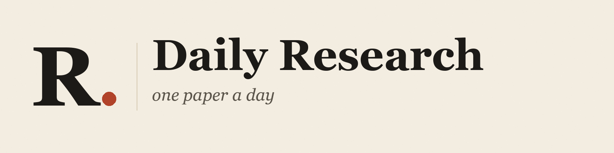
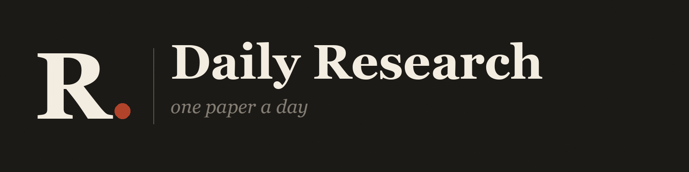
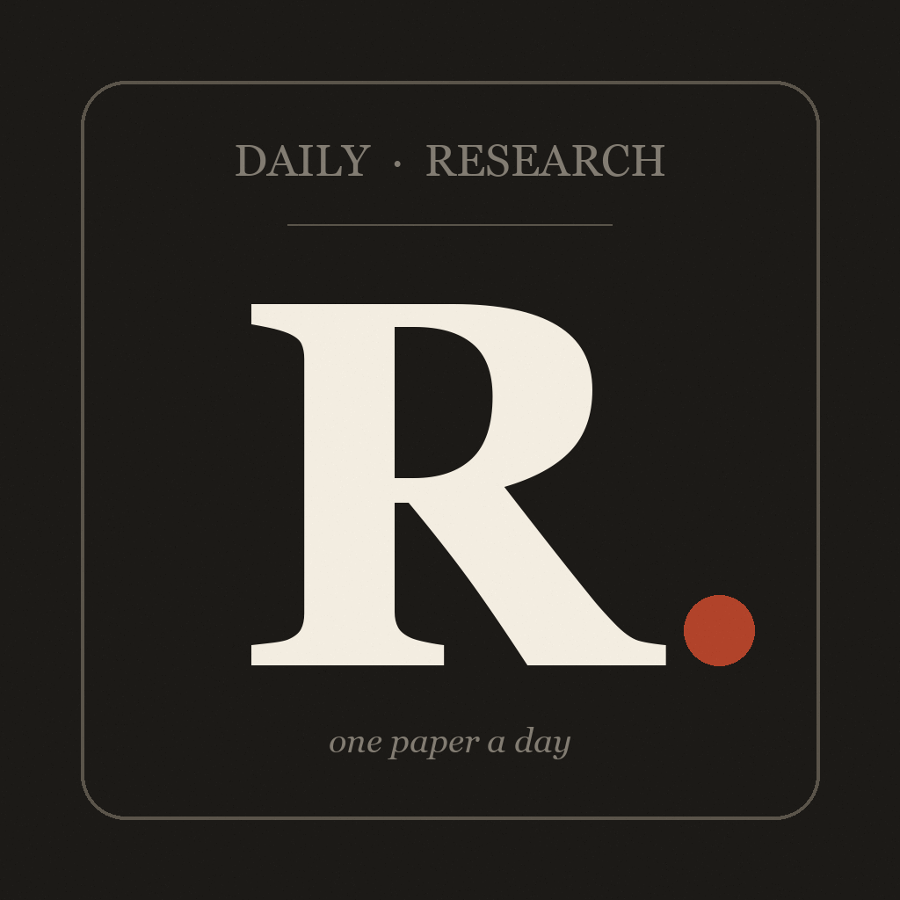

# Daily Research — Brand Guide

A study companion shouldn't feel like another tech product. The brand pulls from editorial print — research papers, newsprint, scholarly journals — to make daily reading feel grounded and intentional.

---

## Logo

The mark is a single serif **R** followed by a rust **period**.

It works on two levels:
- **R.** as "Research."
- The period signals the end of a sentence — the day's reading is *complete*.

| | |
|---|---|
|  | Primary wordmark, light background |
|  | Wordmark on dark surfaces |
|  | App icon, light |
|  | App icon, dark |

### Usage rules
- Minimum size: 48×48 for the icon, 200px wide for the wordmark
- Don't recolor the rust period — it's the only chromatic accent
- Don't stretch the wordmark; if it doesn't fit, use the icon alone
- Always preserve at least one cap-height of clear space around the mark

---

## Palette

Editorial paper tones, not generic dark mode.

| Token | Hex | Use |
|---|---|---|
| Paper | `#f3ede1` | Default background. Warm, off-white, paper-textured |
| Paper Dark | `#e9e0cf` | Card surfaces, modal backgrounds |
| Ink | `#1c1a17` | Primary text, primary buttons |
| Ink Soft | `#5a544a` | Secondary text |
| Ink Faint | `#827c72` | Hairline labels, kickers, captions |
| Line | `#d6cab2` | Dividers, borders |
| Rust | `#b1432a` | The period. The streak flame. Accent only — never decorative |
| AI Green | `#2f5d50` | AI topic accent |
| Markets Ochre | `#9c5a17` | Markets topic accent |

The rust is intentionally rare. If everything is highlighted, nothing is.

---

## Typography

Two families, both unmistakably editorial.

### Display: [Fraunces](https://fonts.google.com/specimen/Fraunces)
A modern revival of a 1900s-era serif. High contrast, generous opticals.
- **Black 900** — masthead title, app icon "R", paper titles
- **SemiBold 600** — section headings, modal titles

### Body: [Newsreader](https://fonts.google.com/specimen/Newsreader)
Designed for long-form on screen. Open counters, comfortable rhythm.
- **Regular 400** — body copy, paper sections, ELI5 bubbles
- **Medium 500** — button labels, emphasized terms
- **Italic** — taglines, captions, "thinking..." states

### Hierarchy at the masthead

```
DAILY                        🔥 12 days
─────────────────────────────────────────
Research.
One paper a day, read in full.
─────────────────────────────────────────
[ AI ]    [ Markets ]
```

Kicker letter-spacing is unusually wide (0.18em) — borrowed from print mastheads.

---

## Voice

Plain. Honest. Slightly editorial.

| Do | Don't |
|---|---|
| "One paper a day, read in full." | "Unlock unlimited research insights with AI!" |
| "Searching the archives…" | "Loading..." |
| "You've read the full paper" | "✅ Completed" |
| "Hi! Ask me anything about this paper." | "How can I help you today?" |

Loading states use period-ellipsis ("Searching the archives…") rather than spinners-with-no-context. The bot says *"I'd need to peek at the paper for that"* instead of inventing.

---

## Motion

- **Rise**: 500ms ease-out, 10px upward translate. Used when a paper or chat reply arrives.
- **Spin**: linear infinite, 1s rotation. Only for genuine in-flight work.
- **Modal slide**: native iOS, full-screen for reader and chat — they deserve attention.

No bouncing. No springs. Nothing that says "this is an app."

---

## Iconography

Lucide React Native, stroke-based.
- Default stroke width: 1.5–2
- Default size: 15–18pt in buttons, 28–34pt in empty states
- Tone: outlined, never filled (except the rust period, which is a circle, not an icon)

Never mix icon sets. Lucide only.

---

## When the brand breaks

If a feature needs to feel different (e.g., a hypothetical premium upgrade screen), it should still use the palette, the typography, and the rust restraint. The brand is not "paper-themed" — it's *paper as a value*. Less, slower, fuller.

---

© 2026 Julian Fellyco. MIT-licensed.
